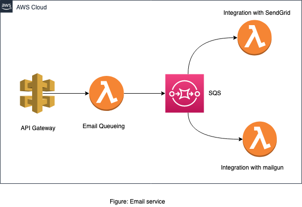

<h3 align="center">SendEmail Service</h3>

<div align="center">

 

</div>

---

<p align="center"> Send email through multiple email service providers 
    <br> 
</p>

## 📝 Table of Contents
- [About](#about)
- [Getting Started](#getting_started)
- [Deployment](#deployment)
- [Usage](#usage)
- [Built Using](#built_using)
- [Acknowledgments](#acknowledgement)

## 🧐 About <a name = "about"></a>
All about sending emails. Exposes API to enable any other service/client to be able to send emails. In a usual setup both email service providers will be able to pick up requests and process. In the event of single service/email provider failure, the message will be returned to the queue for other email provider to process. 



## 🏁 Getting Started <a name = "getting_started"></a>
These instructions will get you a copy of the project up and running on your local machine for development and testing purposes. See [deployment](#deployment) for notes on how to deploy the project on a live system.

### Prerequisites

AWS account and credentials with proper IAM roles and policies to be able to deploy this service. 
- Serverless (sls) installed gobally
- `serverless.yml` file to be edited with appropriate env variables


### Installing

```
npm install
```


## 🔧 Running the tests <a name = "tests"></a>

You can simple run:

```
npm run test
```

Which in the backend executes:

```
nyc --reporter=html --reporter=text sls invoke test --stage=dev
```
To check for coverage

```
npm run coverage
```


## 🎈 Usage <a name="usage"></a>
The system is using aws lambda and exposes RESTful HTTP API, for API schema please check `schemas/sendMail.schema.js` file. Use an online tool like: https://www.jsonschemavalidator.net/ to get a proper payload. 

A simple payload will look like this: 

```
{
  "personalizations": [{
    "to": [
      {
      	"name": "Dear Doe",
      	"email":"doe@doe.com"
      }
    ]
  }],
  "from": {
	"email": "support@siteminder.com"  
  },
"subject": "Test Subject",
"content":[
  {
    "type": "text/plain",
    "value": "Email content in plain text"
  }]

}
```

## 🚀 Deployment <a name = "deployment"></a>
Once you setup the AWS credentials, please deploy via below command:

```
serverless deploy --stage ${stage} --region ap-southeast-1
```

provide appropriate stage to deploy. For example to deploy in dev env, use dev


## ⛏️ Built Using <a name = "built_using"></a>
- [NodeJs](https://nodejs.org/en/) 
- [API Gateway](https://aws.amazon.com/api-gateway/) 
- [AWS SQS](https://aws.amazon.com/sqs/)
- [AWS Lambda](https://aws.amazon.com/lambda/)
- [Serverless](https://serverless.com/) 
 


## 🎉 Acknowledgements <a name = "acknowledgement"></a>
- Wonderful people of open sourced nodejs community. 


TODO: 

- [ ] Reference the queue url automatically from cloudformation stack
- [ ] DLQ need to be setup 
- [ ] Add support for CC and BCC (mailgun)
- [ ] Write more tests
- [ ] Produce swagger/openapi document as API doc. 
